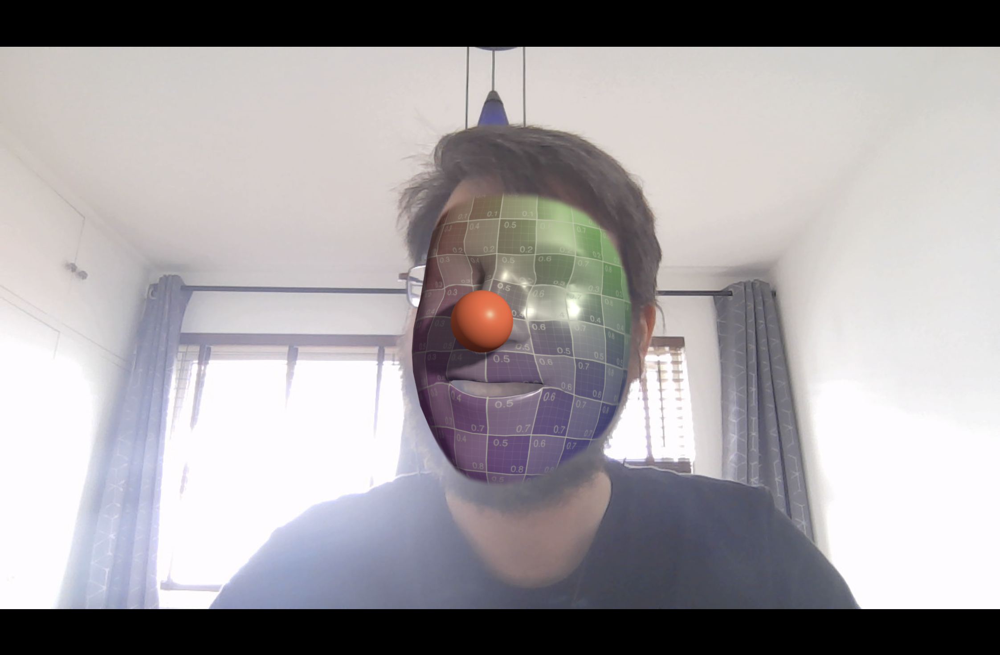

# FaceMeshFaceGeometry

Three.js helper for FaceMesh https://github.com/tensorflow/tfjs-models/tree/master/facemesh

Demo with textured mask: https://spite.github.io/FaceMeshFaceGeometry/examples/mask/index.html

Demo with remapped video: https://spite.github.io/FaceMeshFaceGeometry/examples/video/index.html



## How to use

After following the code in the FaceMesh repo, you end up with a face estimation.

First import the class.

```import { FaceMeshFaceGeometry } from './face.js';```

Create a new geometry helper.

```const faceGeometry = new FaceMeshFaceGeometry();```

On the update loop, after the model returns some faces:

```faceGeometry.setSize(videoWidth, videoHeight);
const faces = await model.estimateFaces(video);
if(faces.length) {
  faceGeometry.update(faces[0]);
}
```
You have to call ```FaceMeshFaceGeometry::setSize``` with the width and height of the video to normalise the coordinates so they align with the video source.

That's all there is. You can use ```faceGeometry``` as any other ```BufferGeometry```:

```const material = new MeshNormalMaterial();
const mask = new Mesh(faceGeometry, material);
scene.add(mask);
```

## Mirrored video

This works for the video as it comes. If your source is a webcam, you might want to flip it horizontally.

In that case -besides flipping the video element, by using ```transform: scaleX(-1)```, for instance- you'll have to pass a flag to ```estimateFaces``` and ```update```:

```faceGeometry.setSize(videoWidth, videoHeight);
const faces = await model.estimateFaces(video, false, true);
if(faces.length) {
  faceGeometry.update(faces[0], true);
}
```
## How to use the video/input as a texture for the face

You can use the input to the FaceMesh model to texture the 3d mesh of the face. Constuct the helper with:

```const faceGeometry = new FaceMeshFaceGeometry({useVideoTexture: true});```

That will remap the UV coordinates of the geometry to fit the input.

## How to update my threejs camera

FaceMesh data works better with an Orthographic camera. First create a camera:

```const camera = new OrthographicCamera(1, 1, 1, 1, -1000, 1000);```

and then when the video is ready, or the video dimensions change (width, height), run:

```
camera.left = -.5 * width;
camera.right = .5 * width;
camera.top = .5 * height;
camera.bottom = -.5 * height;
camera.updateProjectionMatrix();
```

## Track points in geometry

After ```faceGeometry.update()``` you can use ```faceGeometry.track()``` to place objects relative to the surface of the face.

```const track = faceGeometry.track(5, 45, 275);
dummy.position.copy(track.position);
dummy.rotation.setFromRotationMatrix(track.rotation);
```
It will calculate a triangle defined by the three provided vertex ids, and return a ```position```, a ```normal```, and an orthogonal basis ```rotation``` that cane be used to rotate and object along the correct normal of that triangle.

Use [this image](https://user-images.githubusercontent.com/7452527/53465316-4a282000-3a02-11e9-8e85-0006e3100da0.png) as a reference for vertex Ids.

## API

```FaceMeshFaceGeometry::update(face: FaceEstimation, cameraIsFlipped: boolean): void```

Updates the vertices and recalculates normals.

```FaceMeshFaceGeometry::setSize(width: number, height: number): void```

Sets the internal values to reframe the coordinates.

```FaceMeshFaceGeometry::track(id0: number, id1: number, id2: number): { position: Vector3, normal: Vector3, rotation: Matrix4 }```

Calculates a triangle defined by vertices id0, id1 and id2, return its center, normal and orthogonal basis.
